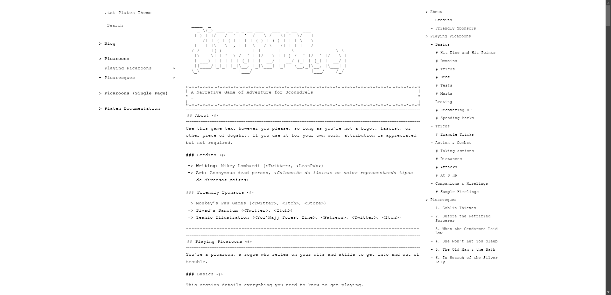

# .txt Template



[Live Preview](https://dot-txt-theme.netlify.app/)

## Installation

Type this in your site directory.

`go get github.com/cyberselkise/dot-txt-theme`

Put this in your config.yaml or hugo.yaml file. This path should be at the top.

```yaml
module:
  imports:
    - path: github.com/cyberselkie/dot-txt-theme
```
